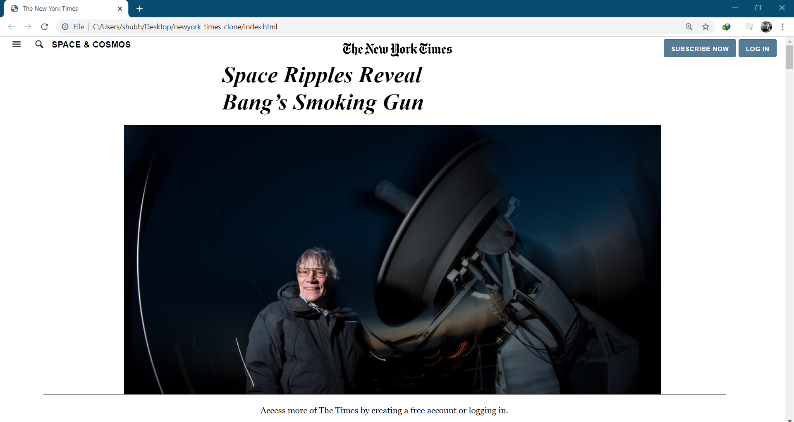

# The New York Times (Positioning and Floating Elements)

> The New York Times has been a leader in experimenting with the inclusion of multimedia content in traditional stories. That creates all kinds of interesting position questions.

In this project, we will be making a copy of article from the New York Times.

Additional description about the project and its features.

## Built With

- HTML
- CSS

## Getting Started

**This is an example of how you may give instructions on setting up your project locally.**
**Modify this file to match your project, remove sections that don't apply. For example: delete the testing section if the currect project doesn't require testing.**

To get a local copy up and running follow these simple example steps.

git clone https://github.com/shubham14p3/newyork-times-clone/

## Authors

👤 **Author1**

- Github: [@ybadmus](https://github.com/ybadmus)
- Linkedin: [ybadmus](https://linkedin.com/ybadmus)

👤 **Author2**

- Github: [@shubham14p3](https://github.com/shubham14p3)
- Linkedin: [Shubham14p3](https://linkedin.com/shubham14p3)

## 🤝 Contributing

Contributions, issues and feature requests are welcome!

Feel free to check the [issues page](https://github.com/shubham14p3/newyork-times-clone/issues).

## Show your support

Give a ⭐️ if you like this project!

## Acknowledgments

- Odin Project

## 📝 License

This project is [MIT](lic.url) licensed.
